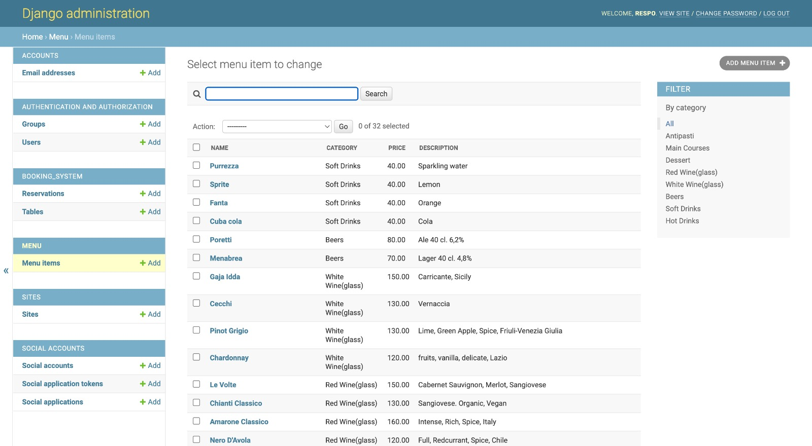
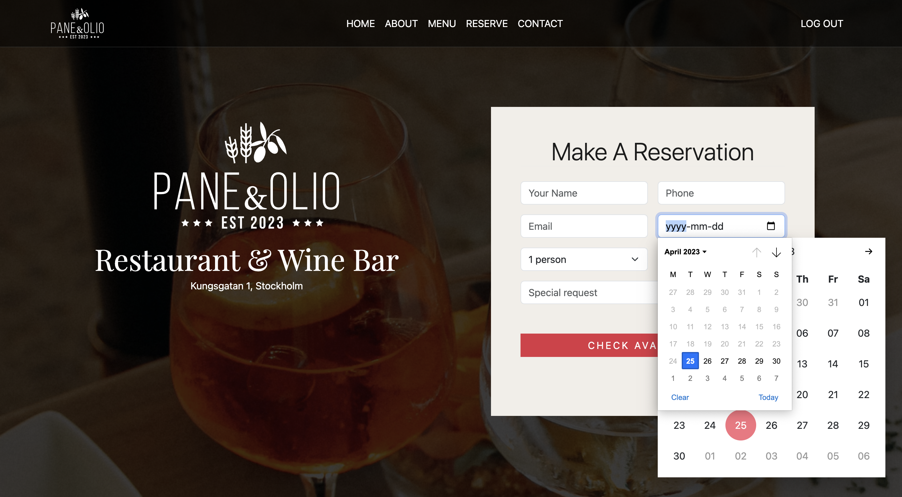

<div style="text-align:center">
  
</div>
<hr>

Welcome to Pane&Olio, a highly acclaimed Italian restaurant located in the heart of Stockholm. Our goal is to provide you with an authentic Italian dining experience, complete with exceptional cuisine and a carefully curated selection of wines.
To book a table, simply create an account on our website. Our reservation system allows you to make reservations for yourself or your friends, and view your reservation details. You can also change or cancel your reservation if needed.
Our menu is updated regularly to ensure that we always serve the freshest dishes. In addition, our website provides access to our opening hours, contact information, and directions to the restaurant.
We invite you to join us for an unforgettable dining experience that will leave you wanting more.

You can find the live link here: [Pane & Olio](https://paneeolio.herokuapp.com/)


___

# Table of Contents

- [About the project](#about-the-project)
- [User Interface](#user-interface)
    * [Color scheme](#color-scheme) 
    * [Typography](#typography)
- [User Experience](#user-experience)
    * [User Stories](#user-stories) 
    * [Sitemap](#sitemap) 
    * [Wireframe mockups](#wireframe-mockups) 
    * [Accessibility](#accessibility)
 - [Structure](#structure) 
    * [Home Page](#home-page) 
        * [Navigation Bar](#navigation-bar) 
        * [Header](#header) 
        * [Content](#content) 
        * [Chef Recommends](#chef-recommends) 
        * [Opening Hours](#opening-hours) 
        * [Footer](#footer) 
    * [About Us](#about-us)
    * [Menu](#menu) 
    * [Authentication](#authentication) 
        * [Sign Up](#signup) 
        * [Log In](#login)
        * [Log Out](#logout)
    * [Reservation](#reservation)
        * [How to Reserve a table](#how-reserve) 
        * [Success message](#success-message) 
        * [Fail message](#fail-message) 
        * [My Reservations](#my-reservations) 
        * [Edit Reservations](#edit-reservations) 
        * [Cancel Reservations](#cancel-reservations)
    * [404 Error page](#404-error-page)
    * [Admin Panel](#admin-panel)
- [Technologies](#technologies) 
- [Agile Development projects](#agile-development-projects)
- [Bugs](#bugs)
- [Future Scope](#future-scope)
- [Testing](#testing)
- [Deployment](#deployment)
    * [Deployment](#deployment) 
    * [Local Development](#local-development)
- [Credits](#credits)

___

# About the project
The website was built using Django, a Python web framework.
The main feature of the website is its booking system, which allows users to reserve a table for a specific date and time. In order to book a table, users need to sign up and log in to the website, which provides user authentication. Once logged in, users can make multiple reservations for different dates and times, specify the number of people and any special requests they may have. Users can also view their reservations, cancel or modify them if needed.
The website also includes a CRUD (Create, Read, Update, Delete) operation for the database. The owner or admin can add or delete user accounts, view reservations, and manage them by changing or deleting them,  adding tables or changing table capacities, reserving tables for callers, etc. 
The owner or admin can also access the admin panel to modify the menu, add new items, and change prices, without the need to access the website's code.
Overall, this website provides an easy-to-use platform for users to book tables and manage reservations, while providing the restaurant's owner or admin with a user-friendly interface to manage bookings, users, and the menu.


# User Interface

## Logo
The logo draws inspiration from the elegant and classic Italian fonts that were popular in the 90s. It features a combination of serif and script fonts, with a slightly bold weight to add a modern touch. 
The main symbol of the logo is a fusion of two classic Italian ingredients - ears of corn and olives. 

## Color scheme
The color scheme draws inspiration from two iconic symbols of Italian cuisine: the deep red of wine and the rich black of coffee. 
The wine red hue is used to evoke feelings of warmth, passion, and indulgence. It is primarily used for accent elements that require attention, such as buttons, icons, and borders. The black shade, reminiscent of a strong and aromatic espresso, is used as the main color for text, backgrounds, and borders. It conveys a sense of sophistication, elegance, and simplicity. Together, these two colors create a bold and timeless color scheme that reflects the essence of Italian cuisine - passion, indulgence, sophistication, and simplicity.


Within the color scheme, the vibrant and eye-catching primary color, #DC3545, is reserved for actionable items such as Call-to-Action (CTA) buttons, clickable links, and important highlights that require user attention.

In contrast, the secondary color, #FFFFFF, is a crisp and clean shade used for the navigation bar, text, and logo, adding clarity and ease of use to the design. 

The tertiary color, #00000, is prevalently used as a background color, providing depth and contrast to the overall aesthetic of the design.

Lastly, the decorative colour #F1EEE9 is mainly used as a background colour for forms and menu.

## Typography
The website utilizes a particular font, Playfair Display, for its header text. Playfair Display is a classic and elegant serif font with high contrast and distinctive letterforms. Its legibility and clarity ensure that the header text remains easily readable and accessible for all users.


As a secondary font, was used the font family bs-font-sans-serif: This font family includes several system fonts and fallbacks. It starts with system-ui, which is a generic font family that maps to the user's preferred system UI font.

 If that is not available, it falls back to a list of specific fonts, such as Segoe UI, Roboto, Helvetica Neue, Noto Sans, Liberation Sans, and Arial. The font family maps to specific fonts on the user's system, so the actual appearance of the text may vary depending on the fonts installed on the user's device.


# User Experience

  ## User Stories

   ### New User
- As a user I want the website to have a simple and organized template so that I can easily navigate and quickly find the information or content I need
- As a user I can sign up and create an account for the website so that I can book a table, edit my booking and comment blogs
- As a user I can access to the menu of the restaurant with details on food and prices by navigating to the dedicated Menu Page
- As a user I can get information about the restaurant by navigating to the section “About Us”
- As a user I can get the information I need on the restaurant location, phone number and opening hours, by scrolling down to the footer 
- As a user I can have an overview of the Chef’s selected dishes 
- As a user I can see a Navigation bar so that I can navigate between the website pages
- Navigation bar can potentially include following pages: Home, About, menu, Reserve, Contact, Log in

   ### Registered User
- As a user I want to be able to sign up with my email, user name and password
- As a user I want to be able to log in with my email and password
- As a user I can select the date, time and number of guests so that I can make a reservation
- As a user I want to be able to add  special requests  during the bookings
- As a user I want to be notified if there is no availability at the slot time I selected
- As a user I can log in to my account so that I can view the list of my bookings
- As a user I can log in to my account so that I can edit my bookings
- As a user I can log in to my account so that I can cancel my bookings
- As a user I can see if I am logged into the account by checking the top nav bar
- As a user I can log out if I am already logged in

   ### Admin
- As a admin I can see the details of each reservations so that I can manage bookings
- As a Admin I can see a list of all upcoming reservations and their details, such as date, time, and party size so that I can manage the tables accordingly
- As an admin, I can modify reservations for customers if they call to request changes so that I can manage their behalf if they are not able to access the website .
- As an admin I can add or remove available time slots from the booking system to reflect changes in the restaurant's seating capacity so that I can always keep updated the time slot availability
- As a admin I can log in to the database and add or remove items from the menus so that allows me to keep the website up to date and provide customers with accurate information about the menu
- As a user I can check the food menu, the drink menu so that I can make an informed decision about what to order

  ## Sitemap
The sitemap provides a clear overview of the website's structure and enables users to navigate through the various pages and pathways available to them. It allows to understand the layout of the website and the different options and routes the user can take to find the information they need.


  ## Wireframe mockups
- Initial wireframes and research are being conducted to explore potential layout options.


- Samples of Mobile wireframes 


  ## Accessibility
  To ensure that the color contrast met the WCAG standards, the "Use Contrast" plug-in was utilized during the design phase on Figma with a focus on accessibility.
  
  
  
  
  
  From the initial accessibility test, I concluded that both text and buttons were easily readable and met the AA and AAA standards.


# Structure

  ## Home page
   **The Home page layout is divided in 4 sections:**
   >#### - ***Navigation bar***
   >#### - ***Header***
   >#### - ***Content***
   >#### - ***Footer***

- ## Navigation Bar
Positioned at the page's uppermost section, the Nav Bar comprises the logo on the left-hand side and links to other pages of the website, including home, about, menu, reserve, and contact. The log in button is on the right-hand side. Its purpose is to facilitate smooth navigation for users across various pages of the website and make the user understand easily if they are logged in or not.


- ## Header
The header section of the website features a background image that spans the full screen, at the center the logo is clearly state with a short description of the restaurant. Below a CTA button invites the user to click to make a reservation.


- ## Content
About Us Is a preliminary section where the user can find information about the restaurant's history, background, and mission. It includes information about the restaurant's atmosphere or ambiance and location.


- ## Chef Recommends
The  section is designed to showcase dishes that the chef personally recommends or considers to be particularly noteworthy. The purpose of this section is to provide customers with recommendations on what to try and also offers insights into the chef's culinary skills and imaginative flair.


- ## Opening Hours
The section provides customers with information about the hours during which the restaurant is open for business. This section includes the days of the week and the specific times that the restaurant is open for breakfast, lunch, and dinner so that customers can plan their visits accordingly and ensure that the restaurant will be open when they wish to dine.
On the right side, there is a section dedicated to highlighted customer’s reviews.


- ## Footer
The footer includes important information about opening hours, contact details, and location.Having contact details, including phone number and email address, included in the footer, make it easy for customers to get in touch with the restaurant. 


  ## About Us
The "About" page is reachable from the top navigation bar or by clicking on the text button “Learn more” in the landing page. This  page  includes information about the restaurant's history, background, and vision. It also features details about the chef and their culinary background, the restaurant's philosophy or approach to food, and any unique or standout menu offerings.
At the end of the page the user can always find the information about opening hours, contacts and location.


  ## Menu
The menu page  contains a wide variety of dishes that are representative of the Italian cuisine. The menu is divided into several sections, such as antipasti, main courses, desserts and drinks. The owner or admin can modify the menu throght admin panel.

The antipasti section includes a variety of cured meats, cheeses, olives, and other small bites that are often served as starters. 

The main course section features various pasta dishes, meat and fish-based dishes. 

Lastly, the dessert section highlights the restaurant's desserts.

In addition, there’s the wine lists, beer lists, and other specialty beverages. 


## Authentication

- ### Sign Up Form
The signup form  allows users to create an account by providing their personal information. The user is required to enter their name, email address, and a password that they will use to log into the website in the future.

A signup form is an essential element of a website that allows users to create a personalized account and access the website's features and content: In this case the sign up form will allow the user to make the reservation to the restaurant.


- ### Log In Form
The login form allows users who have already signed up to access their account by entering their credentials. 

The login form requires users to input their email address along with their password.
A checkbox offer a "remember me" action, which allows users to save their login information for future visits. This makes it more convenient for users to log in quickly without having to re-enter their credentials every time.


- ### Log Out Form
The user can anytime log out from their account by clicking on the button on the top right corner of the navigation bar.

The logout page allows users to log out of their account and has a confirmation message and button. It provides security and privacy for the user's account information and is important for protecting accounts from unauthorized access, especially when using a shared or public device.


## Reservation
The reserve page is hosting a form that allows the user to Make a reservation.

Within the form, users can input their name, phone number, and email address, as well as select their preferred date, time, number of people and special request.


  - ## How to Reserve a table
  In order to proceed with the reservation the user needs to enter all the information required in the form: Name, phone number and email. After inputting the info, the user can select the day from the date picker which opens after clicking on the calendar icon. The time slot, and the number of people are selectable from a drop down.
  

  - ### Success message
  Upon successfully making a reservation, the user will be presented with a confirmation message indicating that the reservation has been secured.
  

  - ### Fail message
  If the reservation is not successful, the user will receive an error message apologizing for the inconvenience and suggesting that they try again by selecting a different date or time. 
  

  - ### My Reservations
  By clicking on the top right button in the navigation bar, A "My Reservations" opens up. The section allows users to view and manage their existing reservations.

  The page displays a list of all the reservations the user has made, including the date and time of each reservation.  
  The "My Reservations" section also allow users to modify or cancel their reservations, as well as make new reservations.
  
  By clicking on the button “View retails” the user can get all the information regarding the selected reservation, such as date, time, number of guests, and any special requests or notes.

  In this section the user can edit the reservation or decide to cancel it.
  

  - ### Edit Reservations
  To modify the reservation, the user is required to select the "Edit reservation" button located at the bottom left. Upon selection, a form displaying the input data will appear, allowing the user to make necessary changes. To save the updated information, the user can click the "submit" button. A “Thank you” message will appear after submitting.
  
  
  

  - ### Cancel Reservations
  To cancel the reservation, the user must click on the "Cancel reservation" button located at the bottom right. After selecting the button, a confirmation message will appear asking if the user is sure to delete. Now the user can decide to proceed with the cancellation or go back to the reservation.

  If the user chooses to continue, a thank you message will show.
  
  
  


## 404 Error page
It is a page that is displayed when a user tries to access a web page that cannot be found. It includes a message informing the user that the requested page cannot be found. 


## Admin Panel
The Admin panel for the restaurant booking system is built using Django.  This allows restaurant staff (Admin) to manage reservations and bookings. In the admin panel, restaurant staff would be able to view, create, edit, and delete reservations for different tables and times.

  ## Add Reservation:
Admin can add a reservation any time they receive a request from customers by accessing to the reservation page from the left menu, clicking on the button “Add reservation” on the top right and proceed with filling the form with all the relevant information.


- ### Change Reservation:
Admin can change the reservation by selecting the section “Reservations” on the left side panel, after that the user needs to select the reservation they are interested.


A fully editable form will show, so that the user can change anything they need to, including date, time, number of people, and the assigned table. After editing they can save and see the updated reservation.


  ## Menu:
The left panel hosts a section dedicated to the Menu. This includes a list of all the items showing in the menu of the website. Any time the Admin User delete, add or change anything in this list, it will be updated on the main menu of the website. 


- ### Add item to Menu:
In ordert to Add and item to the menu, the Admin User can click on the button “Add Menu Item” on the top right of the screen, after that it will be redirected to a page where they can input Name, Category, Description and price of the item.


- ### Change item to Menu:
Admin user is able also to change any of the items of the Menu by selecting the item and editing anything they need in the editable page. Lastly they can decide if to Save or Discard the changes. 


  ## Manage Users:
  From the User management panel, the Admin User has the ability to manage all the registered users on the website, including assigning account names and determining whether they are part of the Staff or not. Admin also can add new users or delete registered users.
  

  ## Manage Tables:
  From the Tables section, the Admin User can select tables, add new tables, change tables number and thei capasity.
  


# Technologies

  ## Languages
  - Django (Python-based web framework for building web applications)
  - HTML (markup language for creating web pages)
  - CSS (style sheet language for describing the presentation of HTML documents)
  - Markdown (markup language used to write README and TESTING documen)
  - Structured Query Language (used to retrieve data from a database)

  ## Tools
  - Django extensions (collection of custom extensions for the Django framework)
  - Allauth (authentication and social login Django app)
  - Crispy Forms (helper Django app to create beautiful forms)
  - ElephantSQL (used as the Postgres database)
  - Bootstrap (used as the front-end CSS framework)
  - Heroku (used for hosting the deployed back-end site)
  - Cloudinary ( Will use it in the future for future scopes)


# Agile Development projects
As a developer who has worked with Agile methodology, I found it to be an effective approach for designing and developing a website for an Italian restaurant as a school project. Agile's emphasis on frequent iterations, testing, and adaptability allowed me to create a website that met the needs of the fictional restaurant and its customers.

Throughout the development process, I leveraged Agile's flexibility, allowing me to quickly make changes in requirements or priorities without significantly disrupting the project.

By following the Agile methodology, I was able to create a final product that was of high quality and suited the needs of the fictional restaurant. Overall, I found Agile to be a valuable approach to web development, even when working on solo projects.

  ## GitHub Projects
  For this project, GitHub Projects was utilized as an Agile tool. The Agile methodology allows for flexibility in project development, making it easier for developers to adapt to changes in requirements or priorities.

  The use of user stories in GitHub makes it easy to create and manage issues, and to track progress on those issues, allowing developers to quickly and easily adjust the project's direction as needed.
  

  ## GitHub Issues
  GitHub Issues is a project management tool that is useful to developers in several ways: facilitates issue tracking, collaboration, prioritization, and integration, all of which have contribute in my case, to a more efficient and effective development process.
  

  ## MoSCoW Prioritization
  The acronym stands for:
  - **Must Have**: requirements that are essential to the success of the project and must be delivered in order to proceed to the next phase or release.
  - **Should Have**: requirements that are important to the success of the project but are not critical and can be deferred to a later release if necessary.
  - **Could Have**: requirements that would be nice to have but are not essential to the project's success and can be deferred to a future release.
  Won't Have: requirements that are not essential to the project's success and will not be delivered in the current or any future release.


# Bugs

  ## 1- Problem:
  I encountered a bug related to the reservation form and model in my Django application. The form was not functioning properly in both the app and admin panel, and I received the following error message:

    "column 'table_id' of relation 'booking_system_reservation' contains null value"

  Furthermore, I was unable to migrate the changes, and I received a prompt to enter a default value : 

    Select an option: 
    Please enter the default value now, as valid Python
    The datetime and django.utils.timezone modules are available, so you can do e.g. timezone.now
    Type 'exit' to exit this prompt

  ### - Solution:
  I found that this error indicated a corruption in the database tables. As a solution, I had to wipe the database, which unfortunately resulted in losing any current database content. This meant that I had to add content to the database again, including superusers.

    To completely remove your Django migrations and reset your database:
    Remove the all migrations files within your project. Go through each of your project apps' migration folders and remove everything inside, except the __init__.py file.
    Drop the database. If you're using Elephant SQL, go to the Elephant SQL dashboard, select your database, and select the reset button. Locally, you can just delete the db.sqlite3  file.
    Run the commands python3 manage.py makemigrations and python3 manage.py migrate to remake migrations and setup the new database.

  ## 2- Problem:
  I aimed to incorporate a calendar into my website that matched its style, by utilizing a [date picker template](https://colorlib.com/wp/template/calendar-14/). However, I encountered an issue where the calendar allowed the selection of dates prior to the current one. While the intended behavior was to restrict the selection to the current date and later.

  ### - Solution:
  In order to achieve this, I used the `DateInput` widget from the Django forms library to display a datepicker calendar on the webpage. The calendar is restricted to valid future choices, as specified in the min attribute of the widget. The `str(date.today())` expression in the `min` attribute sets the minimum date to the current date. Then I removed date picker template.
  


# Future Scope

  ## Blog
  The blog will be a platform where a restaurant can share information and content related to their business. The main purpose of a restaurant blog is to engage with customers, attract new customers, and build a loyal following.

  The blog will offer a variety of content, including: Recipes, stories from the kitchen, wine pairings, Restaurant news and events.
  ### Related user stories:
  - As a admin I want to be able to write blog posts so that I can share information and updates about the restaurant, such as news, upcoming events, or new menu items.
  - As a admin I can approve or delete users' comments so that I can avoid any undesirable content.
  - As a user I can write comments on posts so that I can express my opinion.
  - As a user I can view a list of posts so that I can select one to view.

  ## Reviews
  The review section is a space where customers can share their experiences and opinions about the restaurant. The review section is open to anyone who has visited the restaurant and wants to share their thoughts, and it includes a rating system that allows customers to rate the restaurant based on their overall experience.
  ### Related User Stories: 
  - As a user I want to be able to write reviews on the restaurant website so that I can share with other customers my experience. 
  - As a user I want to be able to see other people's reviews on the restaurant and write comments.
  - As an admin I want to be able to comment and pin my customers' reviews.

  ## Time picker
  As part of the future scope, I’ll enhance the time picker by constraining it to only show future time and not displaying the already passed time. This feature will make it easier for users to select the appropriate reservation time and avoid any confusion that may arise due to the display of past times. Additionally, this enhancement will improve the user experience by providing them with more relevant options to choose from and reduce the likelihood of errors or mistakes in reservation timing.

  ## Foto gallery
  The website will include a photo gallery showcasing the ambiance and cuisine of the restaurant. The gallery could feature high-quality images of the restaurant's decor, signature dishes, and various events held at the restaurant. This addition would provide potential customers with a better visual representation of the offerings and enhance their overall experience with the restaurant. Additionally, the photo gallery can be presented in the form of a slideshow, providing a more interactive experience for users.

  ## Calendar UI
  As part of the future scope  there will be improvement of the UI of the calendar in order to match the look and feel of the website.


# Testing
[TESTING](TESTING.md)


# Deployment
To make the project live, Heroku was used for deployment.

  ## Database (ElephangSQL)
  1. Visit the ElephantSQL website and log in to your account.
  2. In the top-right corner of the page, you'll see a green button labeled "Create New Instance." Click on it.
  3. Enter a name for your database and leave the plan field as is. You can optionally add tags to help you identify the instance later.
  4. Choose the region where you want to host your database.
  5. Click on "Review," check that your details are correct. Then click "Create instance."
  6. Once the instance is created, go to your dashboard and find the new database instance you just created. Click on it.
  7. Look for the URL starting with "postgress://" and copy it.
  8. Open the env.py file and paste the URL as the value for the DATABASE_URL variable. Save the file.

  ## Heroku App Setup
  Set up a new Heroku app and configure it to use your ElephantSQL database by following these steps:
  1. Log in to your Heroku account and navigate to the dashboard.
  2. Click on the "New" button in the top right corner of the page and select "Create New App" from the dropdown menu.
  3. Give the app a unique name and select the region.Then click on the "Create app" button at the bottom left of the page.
  4. Open the "Settings" tab for your new app and scroll down to the "Config Vars" section.
  5. Create a new config var with the name "DATABASE_URL" and paste the database URL you copied from ElephantSQL into the value field (without quotation marks).
  6. Save your changes

  ## Then, in your Django project in Gitpod
  1. Install the dj_database_url and psycopg2 packages by running the following command:

    pip3 install dj_database_url

  2. Update your requirements.txt file with the newly installed packages:

    pip3 freeze > requirements.txt

  3. In your settings.py file, find the DATABASES dictionary and comment out the existing database configuration. Replace it with the following code:
 ```python
    DATABASES = {
    'default': dj_database_url.parse(os.environ.get("DATABASE_URL"))
    }
 ```
  4. Import dj_database_url by adding the following line:

    import dj_database_url

  5. In the GitPod terminal, run the following command to apply database migrations to the new database:

    python3 manage.py migrate

  6. Add the Heroku app URL and localhost to the ALLOWED_HOSTS list in settings.py:

    ALLOWED_HOSTS = ['heroku-app-url-here.herokuapp.com', 'localhost']

  7. Create a new file called Procfile in the root directory of your project and add the following line to it (Replace myproject with the name of your Django project.):

    web: gunicorn myproject.wsgi

  8. Save, commit and push the changes to your Git repository.

  ## Finally:
  1. Go to the Heroku dashboard and select your app. Go to the "Settings" again and scroll down to the "Config Vars" section. 
  2. Set a new config: `DISABLE_COLLECTSTATIC=1` . This can be removed for the final deployment
  3. Go to the "Deploy" tab and connect your app to your Git repository. Enable automatic deploys by selecting your deployment branch and clicking "Enable Automatic Deploys".
  4. Click "Deploy Branch" to deploy the app to Heroku.

  The Django app should now be deployed on Heroku with an external ElephantSQL database.


  ## Local Development

  ### How to Fork
  To fork the repository:
  1. Log in (or sign up) to GitHub.
  2. Go to the repository page on GitHub that you want to fork
  3. Click on the fork button in the top right of the page.
  4. Once the forking process is complete, you will be redirected to the forked repository page in your own account.

  ### How to Clone
  To clone the repository:
  1. Log in (or sign up) to GitHub.
  2. Go to the repository page on GitHub that you want to clone
  3. Click on the "Code" button located towards the top-right of the page
  4. select whether you would like to clone with HTTPS, SSH or the GitHub CLI and copy the link given.
  5. Open the terminal in your IDE 
  6. Navigate to the directory where you want to clone the repository
  7. Type the following command into the terminal git clone followed by the link you copied in step 4.
  8. Press Enter to start the cloning process.


# Credits

  ## Content
  All text content is generated from my own knowledge of Italian restaurants.

  Location, phone number and food prices are fictional.

  ## Media
  - The logo of the website is designed in [Figma](https://www.figma.com/).
  - [Favicon.io](https://favicon.io) tool used to create favicon.
  - The font [Playfair Display](https://fonts.google.com/specimen/Playfair+Display) is a free font from Google Fonts. 
  - All the images used in the project are copyright free from [unsplash.com](https://unsplash.com/):
    - https://unsplash.com/photos/Z49Dre1Mf5M
    - https://unsplash.com/photos/flFd8L7_B3g
    - https://unsplash.com/photos/IeNoBmJ011g
    - https://unsplash.com/photos/N_Y88TWmGwA
    - https://unsplash.com/photos/4nXkhLCrkLo
    - https://unsplash.com/photos/t-7KEq9M0b0
    - https://unsplash.com/photos/_qZOwG2oaj4
    - https://unsplash.com/photos/V2nhzJm-2FM
    - https://unsplash.com/photos/bbCz-78sbmU
    - https://unsplash.com/photos/N_Y88TWmGwA

  ## Code
  - The iFrame code for the map located in the footer is sourced from [Maps](https://www.google.se/maps/)
  - To better understand how testing automation works, I referred to: [MDN web docs](https://developer.mozilla.org/en-US/docs/Learn/Server-side/Django/Testing)
  - I got inspiration from the following website to create the live menu: [Skillshare](https://www.skillshare.com/en/classes/Build-A-Restaurant-Site-With-Python-and-Django/1355998460)
  - To write README and TESTING I used [Markdown](https://en.wikipedia.org/wiki/Markdown)
  - In generel to cretae booking system and for assistance with various issues I used:
    * [Medium](https://blog.devgenius.io/django-tutorial-on-how-to-create-a-booking-system-for-a-health-clinic-9b1920fc2b78)
    * [Stackoverflow](https://stackoverflow.com/questions/54932056/django-reservation-system)
    * [Skillshare](https://www.skillshare.com/en/classes/Build-A-Restaurant-Site-With-Python-and-Django/1355998460)
    * [Youtube](https://www.youtube.com/watch?v=s5xbtuo9pR0&ab_channel=JohnAbdsho)
    * [Github](https://github.com/foad-heidari/dj-booking)
    * [Stackoverflow](https://stackoverflow.com/)

[Back to Top](#)

---


