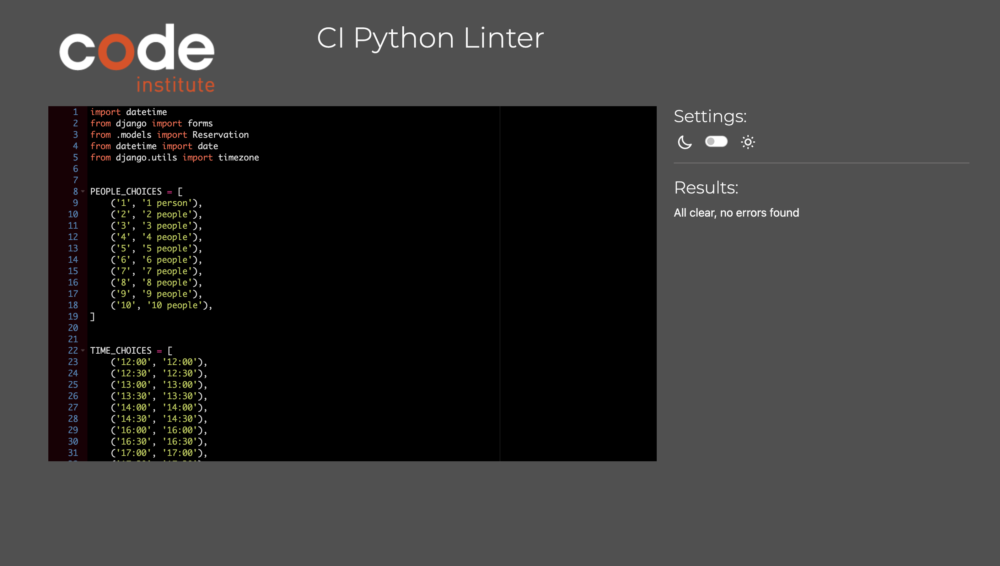
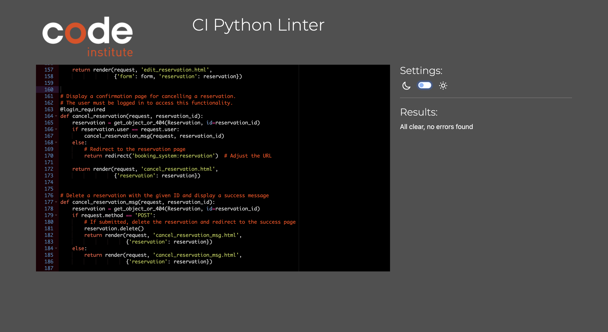
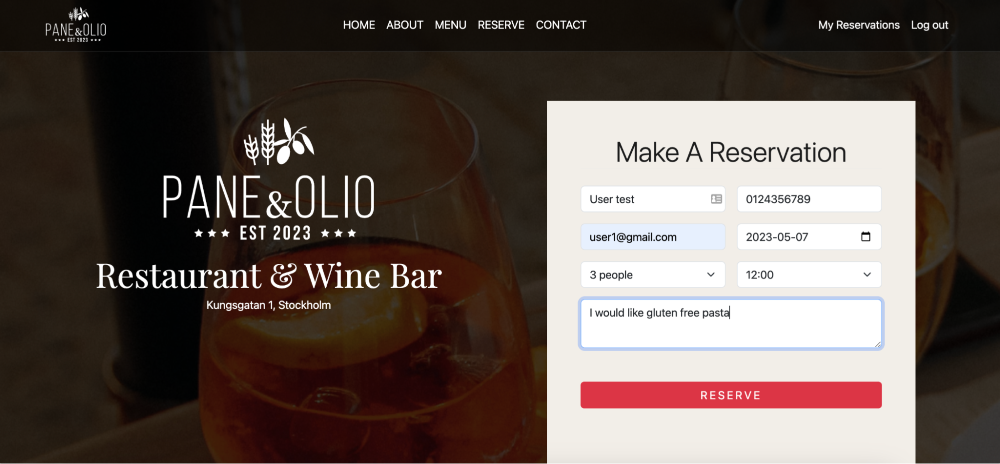
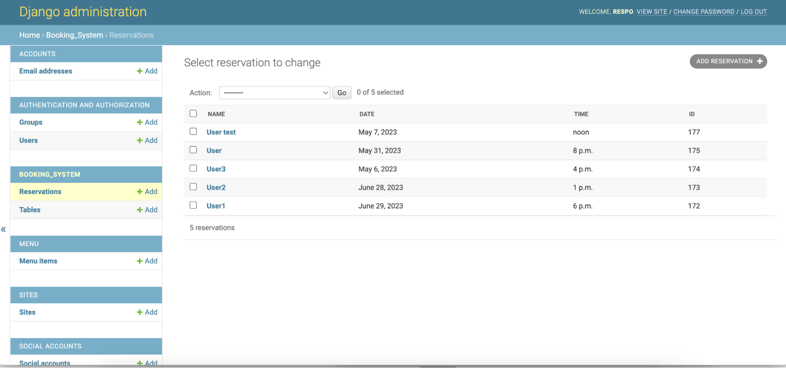

  

You can find the live link here: [Pane & Olio](https://paneeolio.herokuapp.com/)

# Testing

# Table of Contents

- [Validation Testing](#validation-testing)
    * [HTML](#html)
    * [CSS](#css)
    * [Python](#python)
    * [Lighthouse](#lighthouse)
    * [Responsiveness](#responsiveness)
- [Automated Testing](#automated-testing)
    * [Djangon TestCase](#django-testcase)
- [Manual Testing](#manual-testing)
    * [Testing User Stories](#testing-user-stories)
    * [Functional Testing](#functional-testing)
    * [Browsers](#browsers)
    

___

# Validation Testing

## HTML
[W3C validator](https://validator.w3.org/) was used to validate HTML.

| **Page** | **Screenshot** | **Result** |
| -------- | -------------- | ---------- |
| Home |  | Pass |
| About Us |  | Pass |
| Menu |  | Pass |
| Sign Up |  | Pass |
| Log in |  | Pass |
| Reservation Form |  | Pass |
| Reservation List |  | Pass |
| Reservation Details |  | Pass |

## CSS
[Jigsaw validator](https://jigsaw.w3.org/) was used to validate CSS.

| **Page** | **Screenshot** | **Result** |
| -------- | -------------- | ---------- |
| CSS |  | Pass |
    
## Python
[Code Institute Python Linter](https://pep8ci.herokuapp.com/) was used to validate python.

| **App** | **File** | **Screenshot** | **Result** |
| ------- | -------- |--------------- | ---------- |
| Menu | models.py |  | Pass |
| Menu | views.py |  | Pass |
| Booking System | forms.py |  | Pass |
| Booking System | models.py |  | Pass |
| Booking System | urls.py |  | Pass |
| Booking System | views.py |  | Pass |

## Lighthouse
I utilized Google's Lighthouse testing tool to assess the site's performance, accessibility, adherence to best practices, and search engine optimization.

| **Page** | **Screen** | **Screenshot** |
| -------- | ---------- |--------------- |
| Home | Desktop |  |
| Home | Mobile |  |
| About Us | Desktop |  |
| About Us| Mobile |  |
| Menu | Desktop |  |
| Menu | Mobile |  |
| Sign Up | Desktop |  |
| Sign Up | Mobile |  |
| Log in | Desktop |  |
| Log in | Mobile |  |
| Reservation Form | Desktop |  |
| Reservation Form | Mobile |  |
| Reservation List | Desktop |  |
| Reservation List | Mobile |  |
| Change Reservation | Desktop |  |
| Change Reservation | Mobile |  |
| Cancel Reservation | Desktop |  |
| Cancel Reservation | Mobile |  |

## Responsiveness
The website has been thoroughly tested for its responsiveness using tools such as [Am I Responsive](https://ui.dev/amiresponsive) and [RESPONSIVE DESIGN CHECKER](https://responsivedesignchecker.com). It successfully adapts to various screen sizes, ranging from small mobile screens to large desktop displays, as well as medium-sized devices such as iPads and small laptops.

| **Screen** | **Screenshot** |
| ---------- | -------------- |
| Desktop |  |
| Notebook |  |
| Tablet |  |
| Mobile |  |

# Automated Testing

  ## Django TestCase
  [Django TestCase](https://docs.djangoproject.com/en/4.1/topics/testing/overview/) was utilized for conducting automated testing in this project. The testing process involved writing a test, running it in the terminal, identifying and addressing any issues that arise, and rerunning the test to ensure its success.

| **App** | **Screenshot** |
| ---------- | -------------- |
| Menu |  |
| Booking System |  |

# Manual Testing

  ## Testing User Stories
  ### New Users

  | **User Story** | **Screenshot** |
  | -------------- | -------------- |
  | As a user I want the website to have a simple and organized template so that I can easily navigate and quickly find the information or content I need |  |
  | As a user I can sign up and create an account for the website so that I can book a table, edit my booking and comment blogs |  |
  | As a user I can access to the menu of the restaurant with details on food and prices by navigating to the dedicated Menu Page |  |
  | As a user I can get information about the restaurant by navigating to the section “About” |  |
  | As a user I can get the information I need on the restaurant location, phone number and opening hours, by scrolling down to the footer |  |
  | As a user I can have an overview of the Chef’s selected dishes |  |
  | As a user I can see a Navigation bar so that I can navigate between the website pages |  |

   ### Registered Users
  | **User Story** | **Screenshot** |
  | -------------- | -------------- |
  | As a user I want to be able to sign up with my email, user name and password |  |
  | As a user I want to be able to log in with my email and password |  |
  | As a user I can select the date, time and number of guests so that I can make a reservation |  |
  | As a user I want to be able to add  special requests  during the bookings |  |
  | As a user I want to be notified if there is no availability at the slot time I selected |  |
  | As a user I can log in to my account so that I can view the list of my bookings |  |
  | As a user I can log in to my account so that I can  edit my bookings |  |
  | As a user I can log in to my account so that I can cancel my bookings |  |
  | As a user I can see if I am logged into the account by checking the top nav bar |  |
  | As a user I can log out if I am already logged in |  |

   ### Admin
  | **User Story** | **Screenshot** |
  | -------------- | -------------- |
  | As a admin I can see the details of each reservations so that I can manage reservations |  |
  | As a Admin I can see a list of all upcoming reservations and their details, such as date, time, and party size so that I can manage the tables accordingly |  |
  | As an admin, I can modify reservations for customers if they call to request changes so that I can manage their behalf if they are not able to access the website |  |
  | As an admin I can add or remove available time slots from the booking system to reflect changes in the restaurant's seating capacity so that I can always keep updated the time slot availability |   |
  | As a admin I can log in to the database and add or remove items from the menus so that allows me to keep the website up to date and provide customers with accurate information about the menu |   |

  ## Functional Testing
  I conducted functional testing to ensure that the website meets the functional requirements and works as expected.

  | **Page** | **Feature** | **Test Case** | **Expected** | **Result** |
  | -------- | ----------- |-------------- | ------------ | ---------- |
  | *Home Page* |  |  |  |  |
  |  | Button - Make a Reservation | Click it | Redirect to a form to make a reservation  | PASS |
  |  | Text Button - Learn more | Click it | Redirect to “About” page  | PASS |
  | *Sign Upe* |  |  |  |  |
  |  | Text Button - Sign up | Click it | Redirect to a Sign up form  | PASS |
  |  | Sign up form | Fill and click button | Successfully sign up if all the fields are filled   | PASS |
  |  | Sign up form - error | Fill and click button | Error message if the user is already existing   | PASS |
  |  | Error message if email/password not correct | Click log in | Generic Error message got if either email or password are not correct (GDPR compliant)  | PASS |
  |  | Text box - Password | Fill in | Write the password without showing the characters  | PASS |
  |  | Text box -  E-mail | Fill in | Fill the email and get an error message if not correct   | PASS |
  | *Footere* |  |  |  |  |
  |  | Map | Click it | Opens Google Maps page | PASS |
  |  | Button - Make a Reservation | Click it | Redirect to a form to make a reservation  | PASS |
  | *Navigation Bar* |  |  |  |  |
  |  | Nav Button - Home | Click | Redirect to Home page | PASS |
  |  | Nav Button- About | Click | Redirect to About Page | PASS |
  |  | Nav Button - Menu | Click | Redirect to Menu page | PASS |
  |  | Nav Button - Reserve | Click | Redirect to Reserve Page | PASS |
  |  | Nav Button - Contact | Click | Redirect to Footer | PASS |
  |  | Nav Button - My reservations | Click | Redirect to My Reservations Page | PASS |
  | *My Reservations* |  |  |  |  |
  |  | Select reservations dropdown | Click dropdown | View all the reservations booked | PASS |
  |  | Button - View details  | Click | Show all the reservation details | PASS |
  |  | Button - Edit Reservation | Click | Open form to change current reservation | PASS |
  |  | Button - Submit | Click | Successfully saves changes | PASS |
  |  | Button - Cancel Reservation | Click | Redirect to message to confirm Delete action | PASS |
  |  | Button - Confirm | Click | Redirect to thank you message and cancel reservation | PASS |
  |  | Button - Back | Click | Goes back to previous page | PASS |
  | *Log In / out* |  |  |  |  |
  |  | Text Button - Log in | Click it | Redirect to a Log in form | PASS |
  |  | Nav Button- Log in | Click | Redirect to Log in Page | PASS |
  |  | Nav Button - Log out  | Click | Redirect to Log out message | PASS |
  |  | Button - Log out | Click | User is logged out their account| PASS |
  | *Make a reservation* |  |  |  |  |
  |  | Your Name - text box | Fill | Fill successfully with your name | PASS |
  |  | Phone - text box | Fill | Fill successfully with phone number | PASS |
  |  | Email - text box | Fill | Fill successfully with email | PASS |
  |  | Number of people  | Select | Dropdown opens and select the number of people  | PASS |
  |  | Time | Select | Select the time slot form the dropdown | PASS |
  |  | Date | Select | Select the date from the calendar, passed dates are not selectable | PASS |
  |  | Text box - Special request | Fill | Possibility to fill with special requests,  the box is expandable | PASS |
  |  | Button Reserve | Click | Thank you message showing | PASS |
  |  | Button - Done | Click | After making the reservation and click done,  be redirected to the home page | PASS |
  |  | Phone - Text field | Fill wrong | Error message asking to enter a correct number | PASS |
  |  | Email - Text field | Fill wrong email format | Error message asking to enter a valid email address | PASS |

  ## Browsers
  In order to ensure that the website was compatible across various browsers, multiple tests were conducted using different web browsers. This was done to identify any potential compatibility issues and ensure that users would have a consistent experience when accessing the website from different browsers such as Google Chrome, Firefox, Safari, among others.

  | **Browser** | **Screenshot** | **Result** |
  | ----------- | -------------- | ---------- |
  | Chrom |  | Pass |
  | Chrom |  | Pass |
  | Safari |  | Pass |
  | Safari |  | Pass |

---

[Back to Top](#)

---

[Back to README](README.md)